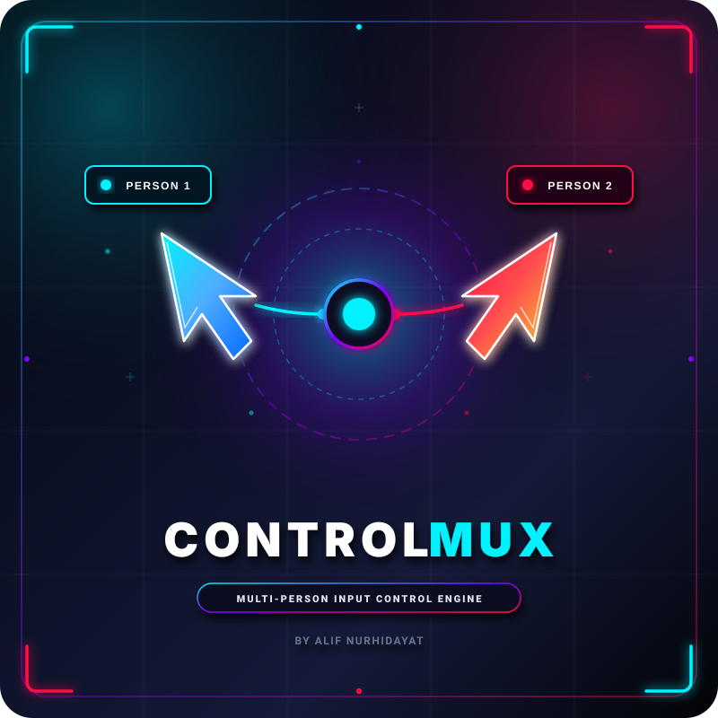

<p align="center">
  
</p>

<h1 align="center">ControlMux 🖱️⌨️</h1>

<p align="center">
  <b>Ultra-Lightweight Multi-Person Input Multiplexing Engine for Windows and Linux</b>
  <br>
  <i>Empower multiple users to operate on a single PC concurrently with dedicated mice, keyboards, virtual cursors, and focus isolation.</i>
</p>

<p align="center">
  Created by <b>Alif Nurhidayat</b> (<a href="mailto:alifnurhidayatwork@gmail.com">alifnurhidayatwork@gmail.com</a>)
</p>

---

## ⚡ Highlights

- **Author**: Alif Nurhidayat (<alifnurhidayatwork@gmail.com>)
- **Ultra-Lightweight & Fast**: Single native C++17 binary (**~191 KB** executable size, **~6.5 MB** RAM usage, **< 0.1%** CPU usage).
- **Cross-Platform Linux & Windows Support**: Native builds on **Arch Linux, Debian, CachyOS, SteamOS, Fedora, Ubuntu, and openSUSE**.
- **Zero Heavy Dependencies**: Built using native platform APIs (`Win32 Raw Input`, `GDI+` on Windows; `libevdev`, `/dev/input/`, `X11`/`Cairo` on Linux). No heavy Python, Node, or Electron runtime needed.
- **Hardware-Level Device Pairing**: Maps physical mice and keyboards by unique hardware HID instance IDs (`HID\VID_xxxx&PID_xxxx` or `/dev/input/by-id/`).
- **Multi-Cursor Overlay**: Transparent, double-buffered screen overlay with colored pointer arrows, click ripple animations, and person name badges (`Person 1`, `Person 2`).
- **1:1 Square App Icon & Vector Source**: Logo is built in a 1:1 square aspect ratio with futuristic corner bracket edges—ready for use as an app icon (`.ico`, `.png`), taskbar icon, or GitHub avatar!
- **Focus Isolation & Input Routing**:
  - **Switched Focus Mode**: Seamlessly switches active OS mouse focus when a person moves/clicks, while isolating secondary keyboards to prevent cross-person keypress pollution.
  - **Direct Target Mode**: Directs keypresses via native message injection to each person's target window handle.
- **System Tray Management**: Easily toggle control, switch routing modes, and view device profiles from the system tray menu.

---

## 🎨 Layered Logo System (Photoshop / Illustrator / Figma Ready)

The ControlMux logo is designed as a **1:1 square multi-layer SVG vector graphics system** so you can freely edit, swap, or tweak any element:

- 📄 **Combined Layered Vector**: [`assets/logo.svg`](file:///d:/CraftThingy/controlmux/assets/logo.svg) (contains labeled `<g id="layer-01-background">`, `<g id="layer-03-cyan-cursor">` layer groups)
- 📂 **Standalone Layer SVGs**: [`assets/logo_layers/`](file:///d:/CraftThingy/controlmux/assets/logo_layers/)
  - `01_background.svg` (Dark gradient background, corner bracket edge accents & tech desktop grid)
  - `02_circuit_core.svg` (Quantum multiplexer core node & circuit trails)
  - `03_cyan_cursor.svg` (Person 1 cyan neon 3D pointer & glassmorphic badge)
  - `04_magenta_cursor.svg` (Person 2 magenta neon 3D pointer & glassmorphic badge)
  - `05_typography.svg` (ControlMux title typography & author credit)

---

## 🏗️ Architecture & How It Works

```
                     ┌───────────────────────────────┐
                     │ Physical Devices (Raw Input)  │
                     │  Mouse 1, Keyboard 1 (Red)    │
                     │  Mouse 2, Keyboard 2 (Blue)   │
                     └───────────────┬───────────────┘
                                     │
                                     ▼
                     ┌───────────────────────────────┐
                     │     Input Engine (WM_INPUT)   │
                     │ Identifies hDevice & Person   │
                     └───────────────┬───────────────┘
                                     │
             ┌───────────────────────┴───────────────────────┐
             ▼                                               ▼
┌─────────────────────────┐                     ┌─────────────────────────┐
│     Focus Router        │                     │   Overlay Renderer      │
│  Resolves target HWND   │                     │ Topmost transparent     │
│  Isolates & routes keys │                     │ GDI+ double-buffer canvas│
└─────────────────────────┘                     └─────────────────────────┘
```

1. **Device Manager (`src/device_manager.hpp / .cpp / _linux.cpp`)**: Enumerates HID devices (`GetRawInputDeviceList` on Windows, `libevdev` / `/dev/input/` on Linux) and maps physical device handles to `PersonState` profiles.
2. **Input Engine (`src/input_engine.hpp / .cpp`)**: Intercepts raw input events before OS aggregation.
3. **Overlay Renderer (`src/overlay_renderer.hpp / .cpp`)**: Renders virtual pointers and user badges on a click-through layered window.
4. **Focus Router (`src/focus_router.hpp / .cpp`)**: Computes target window handles under each person's cursor and handles keystroke isolation/routing.
5. **System Tray GUI (`src/gui_win32.hpp / .cpp`)**: Controls tray icon tooltip, popup menus, and pairing dialogs.

---

## 🚀 Building ControlMux

### Windows (MinGW-W64 GCC)
```bash
# Compile controlmux.exe
g++ -O2 -std=c++17 -Wall -Wextra -Wno-unused-parameter -Wno-missing-field-initializers -municode -mwindows -Isrc -o controlmux.exe src/main.cpp src/config.cpp src/device_manager.cpp src/overlay_renderer.cpp src/focus_router.cpp src/input_engine.cpp src/gui_win32.cpp -luser32 -lgdi32 -lgdiplus -lhid -lshell32
```

Or using Makefile:
```bash
make
```

### Linux (Arch Linux, CachyOS, SteamOS, Debian/Ubuntu, Fedora)
Ensure dependencies are installed (`libevdev`, `x11`, `cairo`):

- **Arch Linux / CachyOS / SteamOS**:
  ```bash
  sudo pacman -S gcc make cmake libevdev libx11 cairo
  make -f Makefile.linux
  ```
- **Debian / Ubuntu**:
  ```bash
  sudo apt install build-essential libevdev-dev libx11-dev libcairo2-dev
  make -f Makefile.linux
  ```

### CMake Build System (Cross-Platform)
```bash
mkdir build && cd build
cmake ..
cmake --build .
```

---

## ⚖️ License Terms ([LICENSE.md](file:///d:/CraftThingy/controlmux/LICENSE.md))

Copyright (c) 2026 **Alif Nurhidayat** (`alifnurhidayatwork@gmail.com`).

- **Personal & Non-Commercial Use**: Completely **FREE** to use, modify, and study for personal, research, or educational purposes.
- **Share-Alike Requirement**: Any modifications, forks, or derivative works must be publicly shared open-source under the exact same license terms.
- **Corporate & Commercial Royalty**: Commercial entities, corporations, and revenue-generating organizations **must pay a commercial royalty license** to Alif Nurhidayat (`alifnurhidayatwork@gmail.com`) to deploy, integrate, or use ControlMux in business environments.
